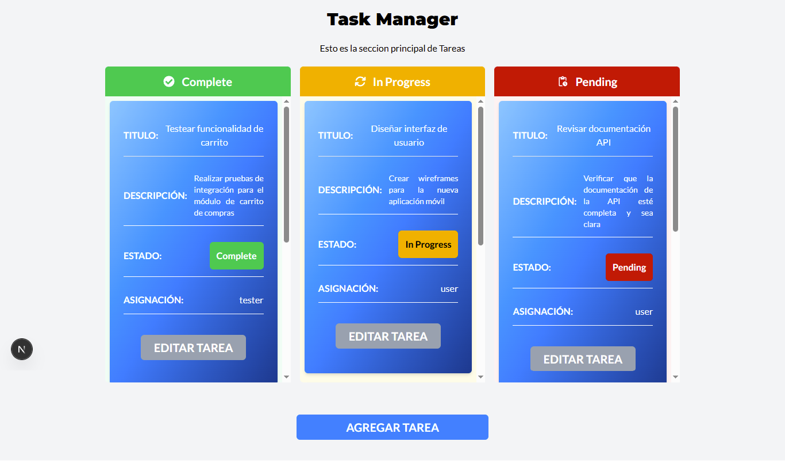

App de tareas
  

Es un proyecto de ejemplo para la prueba tecnica de la empresa es la primera vez que se ha usado next.js y es un gran reto para aprender y practicar. Tiene una gran documentación y vale la pena que en verdad dar lo mejor. Me falta mucho pero estoy siempre en dispoción para aprender y mejorar.

Este proyecto es un ejemplo de como se puede crear una aplicación de tareas con next.js y react. Está hecho con typescript y usa zod para validar los datos enviados. También usa redux para manejar los datos y json-server para el backend.

Indicaciones:

Primero debes instalar las dependencias

```
npm install
```

Agregar la variable de entorno con la siguiente url

    ENV_API_SERVER=http://localhost:3001/tareas

y luego ejecutar el siguiente comando

    npm run dev

para ver el proyecto completo visita el siguiente link:

tiene los siguientes componentes:

client

- RadioButtonStatus
- SelectUserAssigned
- TareaList
- TareaForm (Formulario para crear tareas)
- ProviderRedux

server

- TareaCard

Paginas:

- Home

Rutas manejadas por next.js:

- /
- /tareas/add
- /tareas/edit/:id

schemas:

- index.ts

Redux:

- store
- tasksSlice

utils:

- arrayStateTareas
- arrayUsers
- changeColor
- getNames

data:

- getTareas

db:

- db.ts

ui:

- fonts

types:

- index.ts
  algunos tipados son:
  - Tarea
  - DraftTarea
  - Tareas
  - User

Espero les guste este proyecto para la prueba tecnica de la empresa.
